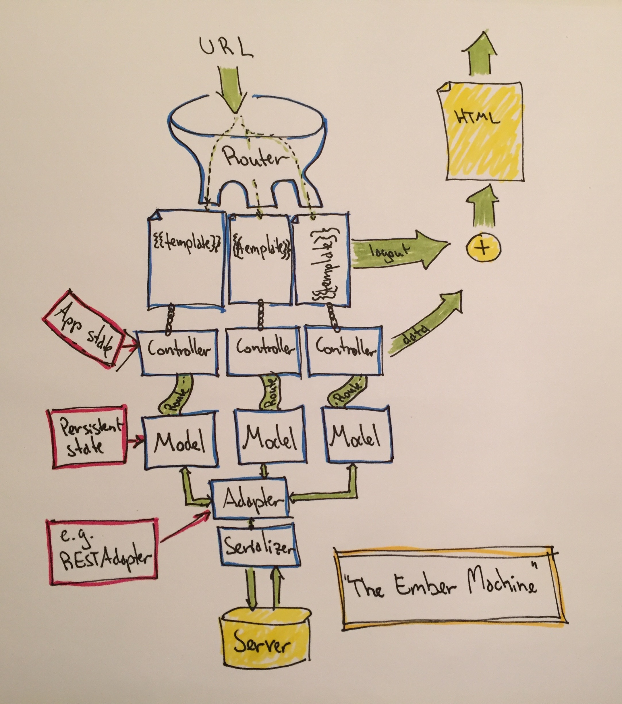
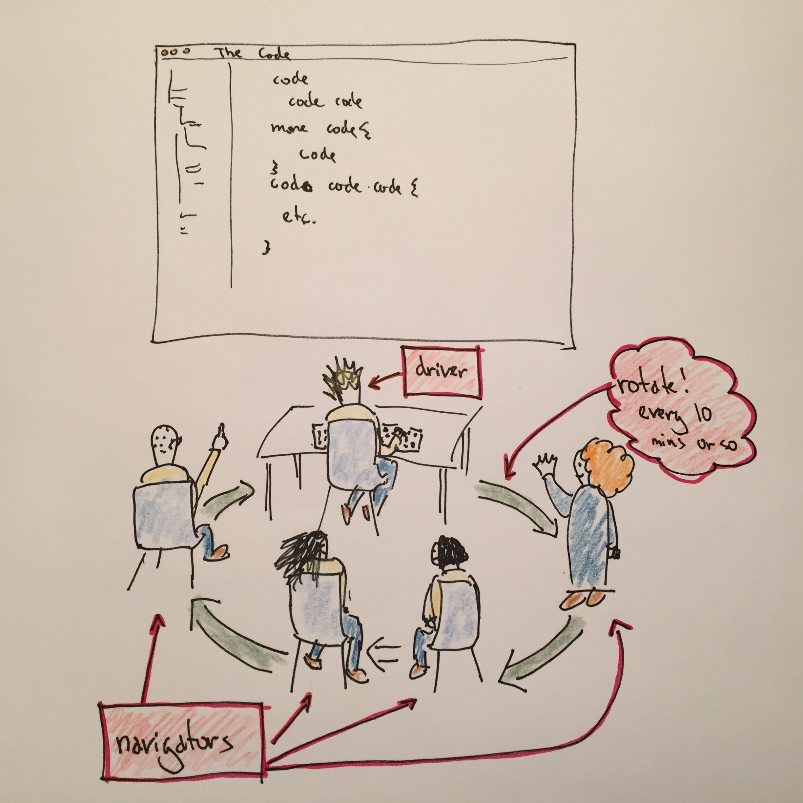

class: center, middle
count: false
name: start
# Frontend testing with Ember.js


---

name: agenda
# Agenda

1. About us!
2. Why frontend testing and Ember.js?
3. Type of tests in Ember.js
4. Ember.js
5. Setup basic Ember project with tests
6. Mob programming

.op-logo[]
---

name: types-of-test
# Types of tests in Ember.js
### Acceptance
- User interaction and application flow
- E.g. complete user stories

### Unit
- Testing isolated chunks of data (_units_)
- E.g. application logic and algorithms

### Integration
- Verify interactions between application parts
- E.g. data transfers and actions

.op-logo[]
---

name: ember-concept
# Ember.js

.mainpic[]
.op-logo[]
---

name: ember-req
# Setup basic Ember project
## Ember requires:
- [Node.js](http://nodejs.org/) >= version 0.12 and npm <= version 2.7
- [Git](https://git-scm.com/book/en/v2/Getting-Started-Installing-Git)
- [Ember CLI](http://ember-cli.com/): `npm install -g ember-cli`
- [Mirage](http://www.ember-cli-mirage.com/):  `ember install ember-cli-mirage` (mock out JSON API)

## Optional:
- [Bower](http://bower.io/): `npm install -g bower`
- [PhantomJS](http://phantomjs.org/):  `npm install -g phantomjs` (run tests from cli)
- [Watchman](https://facebook.github.io/watchman/) `brew install watchman`  (version 3.x, auto-complie)
- Development browser inspector extensions; [Chrome](https://chrome.google.com/webstore/detail/ember-inspector/bmdblncegkenkacieihfhpjfppoconhi)
and [Firefox](https://addons.mozilla.org/en-US/firefox/addon/ember-inspector/)

.op-logo[]
---

name: ember-setup
# Setup basic Ember project - _Create new app_
- `ember new ember-sample-app && cd ember-sample-app`
- Update to [latest](http://emberjs.com/builds/) ember: `ember-messenger/bower.json`
```json
"ember": "2.2.0",
"ember-data": "2.0",
"jquery": "1.11.3",
```
- `npm install && bower install`
- `ember server`, `ember serve` or `ember s`
- Visit the app at [localhost:4200](http://localhost:4200)
- Generate blueprints: `ember generate...`
```terminal
ember g route _route-name_
ember g model _model-name_
ember g component _component-name_
```

.op-logo[]
---

name: mob
# Mob Programming

.mainpic[]
.op-logo[]
